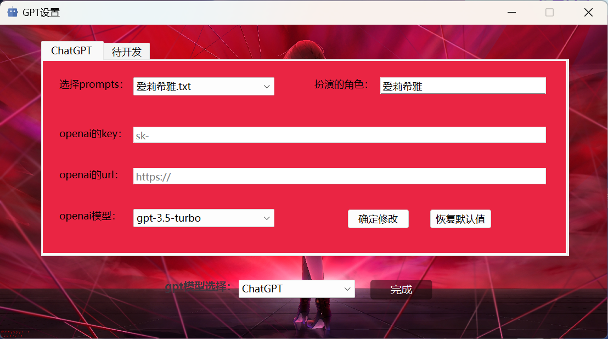

# gpt-cosplay2.0

### 开发心得
- 项目的目标是什么？

- 1. 开发一个可以整合市面上gpt等对话模型和vits语音模型。
- 2. 最开始写1.0的时候，其实主要是我买了个爱莉希雅的官方闹钟，因为官方的闹钟是有源语音的，但是非常的死板，我就想着能不能自己开发一个可以对话的程序，把声音换成爱莉希雅然后链接到闹钟这样不就完美了吗，所以我就搞了1.0，但是1.0确实太简陋了，最后还是想加个ui的，把功能完善一下就变成了2.0。
- 3. 后面我有时间也会继续开发，毕竟才有一个chatgpt和vits的模型，还有很多模型可以整合进来。
- 项目的难点是什么？
- 1. 毕竟这个项目比较简单，所以也没有什么难度，主要还是自己一开始没有写项目策划书什么的，所以一开始写的时候很混乱，后面才慢慢整理好的。
- 2. 很多功能都是边写边想的，所以有些地方写的不是很好，后面有时间会继续优化。
- 3. 如果遇到什么bug的话，请到github上提issue，我会尽快解决的。


### 项目描述
1. 可以实现语音与特定人物的对话，目前支持的人物全靠vits自己训练的模型和chatgpt的prompt。所以都需要手动导入，具体怎么操作文档后面会有提到。
2. 因为语音识别是用的谷歌的，所以需要用梯子。之前也用过本地的模型但是效果确实不是很好，所以就放弃了。后面有时间会更新国内的语音识别模型。
3. 关于vits的api，可以参考这个[vits-simple-api](https://github.com/Artrajz/vits-simple-api)项目。可以自己部署到本地或者服务器上，然后把地址改成自己的地址。本项目默认的是本地的地址。

### 软件版本
* **2.0.1:** 稳定版，修改了一些恶性bug--配置不当导致软件闪退。增加chatgpt的版本，以前只能是3.5，这次增加了4.0的版本，可以自由切换。

### 软件使用说明
1. 可以在[Release](https://github.com/daiHao4312/gpt-cosplay2.0/releases/tag/v2.0.1)页面下载最新的版本。
2. 本项目是直接打包之后的，所以不需要安装python环境，直接双击exe文件就可以运行了。
3. 如果不想直接下载打包版本，可以直接拷贝代码到本地，然后安装依赖，然后运行```main.py```文件就可以了。
4. 所有的依赖都在```requirements.txt```里面，可以直接用```pip install -r requirements.txt```安装。

#### 主界面


- **语音输入：** 如果想要语音输入，需要点击绿色的语音图标，然后说话，说完之后再点击一次绿色的图标，就可以识别了。文字会直接输出到输入框，点击发送就可以发送了。(大家觉得录音完后直接发送，还是点击发送好？)
- **文本输入：** 可以直接在输入框输入文字，然后点击发送就可以发送了。
- **发送：** 如果是第一次开始对话，那么点击发送后会弹出需要输入本次对话的标题，标题会显示在历史记录那里。
- **历史记录：** 可以点击历史记录，然后选择之前的对话，然后点击选定记录就可以查看以前的对话了。(现在只是查看，没有继续对话的功能，后面会加上的)。在选定记录前如果正在对话的话，会强制结束对话哦。
- **清除对话：** 如果不想对话了点击这个就会就结束对话了。
- **vits语音播报：** 会在ai输出后自动播放vits的语音。不想播放的话可以在设置里面关掉。
- **提示：** 在主界面左下角会有当前选择模型的提示，如果更换了模型没有更新的话，点击一下输入框就可以了。

#### 设置界面
- 设置在主界面的左上角，点击设置按钮就可以看到vits和gpt的设置了。
##### vits设置

- **修改：** 点击确认修改就行了。
- **试听：** 修改后可以在这里试听一下。输入什么会读什么。
- **选择模型：** 没有vits模型的时候记得选无。

##### gpt设置


- **修改：** 点击确认修改就行了。
- **选择prompts：** 你需要自己导入prompt，然后选择一个就可以了。 路径：```module/gpt_api/gpt_prompts```
- txt文件里一行就是一段话，切记每一句要换行，不让一句太多。太多会爆炸的。


##### 恢复默认值（在前面的设置中有默认设置的按钮）
1. 默认设置是作者已经定死了的，如果想修改只能去源代码里面修改了。
2. gpt默认设置在```setting/set_gpt/setGptConfig.py```里面，可以自己修改。在函数```RestoreDefaultValues```里面修改。
```python
            self.openaiKeyInput.setText("")
            self.openaiUrlInput.setText("")
            self.rolesInput.setText("爱莉希雅")
            self.promptsComboBox.setCurrentText("爱莉希雅.txt")
            self.chatModeComboBox.setCurrentText("gpt-3.5-turbo")
```
3. vits默认设置在```setting/set_vits/setVitsConfig.py```里面，可以自己修改。在函数```RestoreDefaultValues```里面修改。
```python
            self.vitsIdInput.setText("225")
            self.vitsLangInput.setText("zh")
            self.vitsLengthInput.setText("1.4")
            self.vitsApiInput.setText("http://127.0.0.1:23456/voice/vits")
            self.vitsWavPathInput.setText("./module/vits_api/vits_wav/vits_voice.wav")
```

#### 结语
- 本项目是我自己开发的，所以可能有很多bug，如果有什么问题的话，可以在github上提issue，我会尽快解决的。
- 我之前的1.0是这个项目的小demo，如果对这个感兴趣可以去试试1.0，1.0会比较简单，代码也比较清晰。
- 因为这次写的比较匆忙，所以有些地方代码写的不是很好，后面有时间会继续优化。
- 这次的项目主要是由python3.10和pyqt6写的。
- 本项目主要用于学习交流，不要用于商业用途！